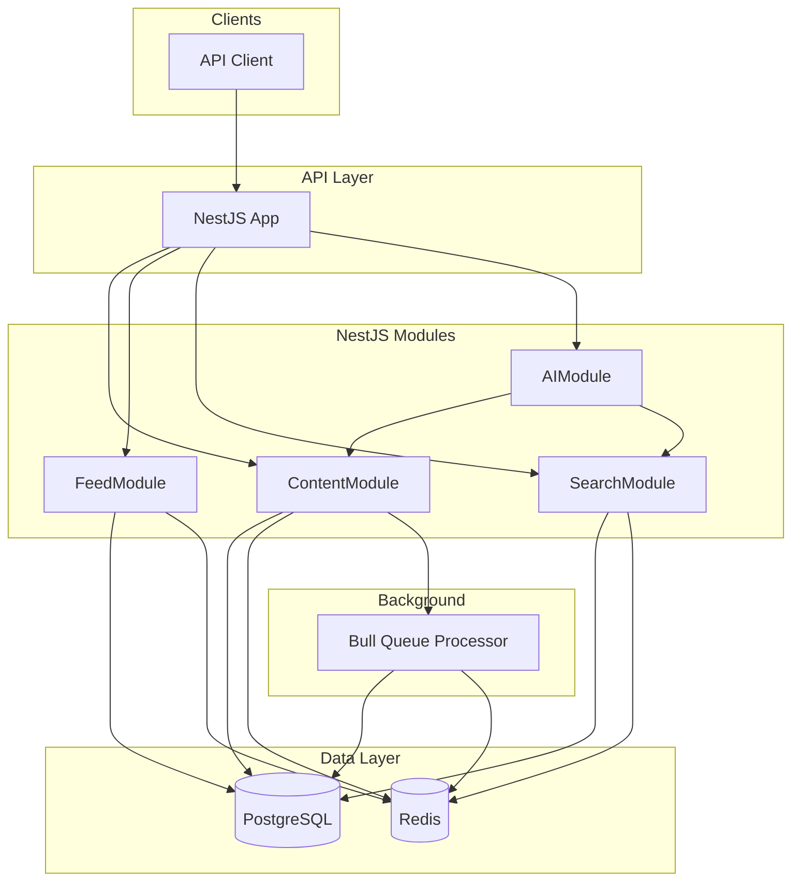
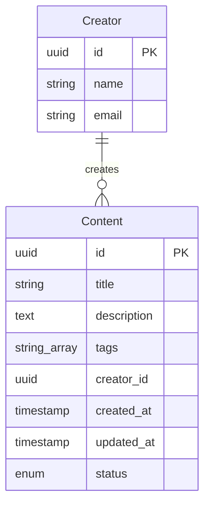

# Content Platform Backend - NestJS Implementation Plan

## Architecture Overview



**Tech Stack**

- **Framework**: NestJS (TypeScript, modular, DI, built-in patterns)
- **Database**: PostgreSQL with TypeORM (migrations, relations, full-text search)
- **Cache + Queue**: Redis — Bull for queue, nestjs/cache-manager with Redis store for caching
- **AI**: Google Gemini via `@google/genai` with function calling (tool use)
- **Validation**: class-validator + class-transformer (built into NestJS)

**Rationale**: NestJS provides clear module boundaries, dependency injection for testability, and first-class support for queues (Bull) and caching. TypeORM integrates well with PostgreSQL full-text search.

---

## Data Model



**Content Entity**

- `id` (UUID, PK)
- `title` (varchar 255)
- `description` (text)
- `tags` (simple-array / string[])
- `creatorId` (UUID, FK to creators)
- `createdAt`, `updatedAt` (timestamps)
- `status` (enum: draft | published | archived)

**Creator Entity**

- `id`, `name`, `email`

**Indexes**

- `created_at DESC` for feed ordering
- GIN index on `tags` for tag filtering
- Full-text: `tsvector` on (title, description) via TypeORM `@Index` or raw migration

---

## Project Structure

```
uvivio-test/
├── src/
│   ├── main.ts
│   ├── app.module.ts
│   ├── config/
│   │   └── configuration.ts
│   ├── common/
│   │   ├── cache/
│   │   │   └── cache.module.ts
│   │   └── database/
│   │       └── database.module.ts
│   ├── content/
│   │   ├── content.module.ts
│   │   ├── content.controller.ts
│   │   ├── content.service.ts
│   │   ├── entities/
│   │   │   └── content.entity.ts
│   │   ├── dto/
│   │   │   ├── create-content.dto.ts
│   │   │   └── content-response.dto.ts
│   │   └── content.processor.ts      # Bull job processor
│   ├── creator/
│   │   ├── creator.module.ts
│   │   ├── creator.controller.ts
│   │   ├── creator.service.ts
│   │   └── entities/
│   │       └── creator.entity.ts
│   ├── feed/
│   │   ├── feed.module.ts
│   │   ├── feed.controller.ts
│   │   └── feed.service.ts
│   ├── search/
│   │   ├── search.module.ts
│   │   ├── search.controller.ts
│   │   └── search.service.ts
│   └── ai/
│       ├── ai.module.ts
│       ├── ai.controller.ts
│       └── ai.service.ts            # LLM orchestration, tool definitions
├── typeorm/
│   └── migrations/
├── docker-compose.yml
├── Dockerfile
├── package.json
└── README.md
```

---

## Component Details

### 1. Content Publishing (Async via Bull Queue)

**Flow**: `POST /content` → ContentService creates draft → `ContentProcessor` job enqueued → Worker validates, indexes, sets status to published.

- **Queue**: `@nestjs/bull` with Redis. Queue name: `content`.
- **Job**: `process-content` — payload: `{ contentId }`. Worker updates search vector, sets status to `published`.
- **Processor**: `ContentProcessor` in content module, decorated with `@Processor('content')`.

### 2. Feed Endpoint

**Endpoint**: `GET /feed?limit=20&offset=0`

- **Service**: Orders by `createdAt DESC`, paginated. Uses `CacheManager` (Redis) with key `feed:${page}`.
- **Cache TTL**: 120 seconds. Invalidate on publish via `CacheModule` inject.

### 3. Search

**Endpoint**: `GET /search?q=...&tags=...`

- **TypeORM**: Use `QueryBuilder` with `where` + raw `ts_rank` or `ts_vector` for full-text.
- **Tags**: `tags && :tags` (array overlap) or `:tags = ANY(tags)`.
- **Cache**: Key `search:${hash(q+tags+page)}`, TTL 60s.

### 4. AI-Powered Endpoint (Tool Calling)

**Endpoint**: `POST /ai/assist` — body: `{ "query": "Summarize content X" }` or `{ "query": "Find content about machine learning" }`.

**AIService** (orchestration layer, not in controller):

- Define tools as Gemini function declarations (`FunctionDeclaration`):
  - `get_content_by_id`: `{ name, description, parameters: { type: OBJECT, properties: { content_id } } }`
  - `search_content`: `{ name, description, parameters: { type: OBJECT, properties: { query, tags? } } }`
- Inject `ContentService`, `SearchService` — implement tool handlers.
- Use `@google/genai` client: `generateContent()` with `tools: [{ functionDeclarations: [...] }]`.
- On `functionCalls` in response, invoke corresponding service method, pass results back via `functionResponse`.
- Continue generation loop until final text response; map to DTO (e.g. `{ summary, contentId }`).
- Use `responseMimeType: "application/json"` for structured JSON output.

### 5. Caching Strategy

| Resource   | Key Pattern      | TTL  | Invalidation       |
| ---------- | ---------------- | ---- | ------------------ |
| Feed page  | `feed:${page}`   | 120s | On content publish |
| Search     | `search:${hash}` | 60s  | None (short TTL)   |
| Content ID | `content:${id}`  | 300s | On update/delete   |

**Implementation**: `CacheModule` from `@nestjs/cache-manager` + `cache-manager-redis-store`. Inject `CACHE_MANAGER` in services.

---

## Performance Considerations

1. **Database**: TypeORM connection pool; indexes on feed and search columns.
2. **Caching**: Cache-aside for feed and search hot paths.
3. **Pagination**: Offset-based for scope; cursor-based possible later.
4. **Queue**: Bull concurrency configurable; separate worker process or `BullModule.registerQueue` in app.
5. **AI**: Timeout on Gemini API calls; structured output via `responseMimeType` for consistency.

---

## Docker & Local Run

**docker-compose.yml**:

- `postgres:15-alpine` (port 5432)
- `redis:7-alpine` (port 6379)

**Run**:

- `docker-compose up -d`
- `npm run start:dev` for API
- Bull processor runs in same process by default (or separate worker app if desired)

**Environment**: `.env` with `DATABASE_URL`, `REDIS_HOST`, `REDIS_PORT`, `GEMINI_API_KEY` (from Google AI Studio).

---

## README Outline

1. Architecture overview and key decisions (diagram + NestJS rationale)
2. Data model (entities, indexes)
3. Background processing (Bull queue, ContentProcessor)
4. Caching approach (keys, TTL, invalidation)
5. AI integration (tools, AIService orchestration, structured output)
6. Performance considerations
7. How to run (Docker, env vars, endpoints)

---

## API Endpoints Summary

| Method | Path         | Purpose                         |
| ------ | ------------ | ------------------------------- |
| POST   | /creators    | Create creator                  |
| POST   | /content     | Publish content (enqueues job)  |
| GET    | /content/:id | Get content by ID               |
| GET    | /feed        | Paginated feed (cached)         |
| GET    | /search      | Search by query + tags (cached) |
| POST   | /ai/assist   | AI assistant with tool calls    |

---

## Key Dependencies

```json
{
  "@nestjs/core": "^10.x",
  "@nestjs/typeorm": "^10.x",
  "typeorm": "^0.3.x",
  "pg": "^8.x",
  "@nestjs/bull": "^10.x",
  "bull": "^4.x",
  "@nestjs/cache-manager": "^2.x",
  "cache-manager-redis-store": "^3.x",
  "@google/genai": "^0.2.x",
  "class-validator": "^0.14.x",
  "class-transformer": "^0.5.x"
}
```
