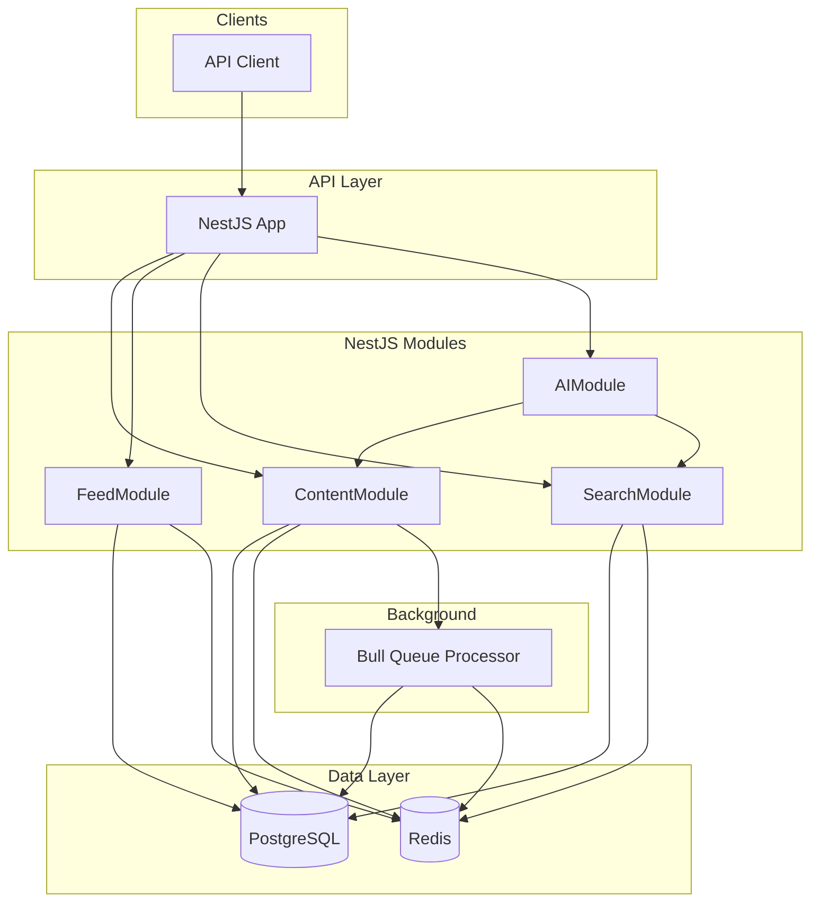

# Content Platform Backend

A backend service for a simple content platform. Creators publish content (title, description, tags); users fetch a feed and search for content. Built with NestJS, PostgreSQL, Redis, and Google Gemini AI.

## Architecture Overview



### Key Decisions

- **NestJS**: Modular structure, dependency injection, built-in support for queues (Bull) and caching
- **PostgreSQL**: ACID compliance, native full-text search (`to_tsvector`/`plainto_tsquery`)
- **Redis**: Single infrastructure for both Bull queue and cache store
- **Gemini**: LLM with function calling for AI-powered assist endpoint

---

## Data Model

### Creator
- `id` (integer, PK, auto-increment)
- `name` (varchar 255)
- `email` (varchar 255, unique)
- `createdAt`

### Content
- `id` (integer, PK, auto-increment)
- `title` (varchar 255)
- `description` (text)
- `tags` (text[], PostgreSQL array)
- `creatorId` (integer, FK to creators)
- `status` (enum: draft | published | archived)
- `createdAt`, `updatedAt`

### Indexes
- `content.created_at` for feed ordering
- `content.status` for filtering published content
- Full-text search via `to_tsvector` on title + description (computed at query time)

---

## Background Processing

Content publishing is asynchronous via a **Bull queue**:

1. `POST /content` creates content with status `draft` and enqueues a job
2. **ContentProcessor** consumes `process-content` jobs
3. Worker updates status to `published` and invalidates feed cache

The queue uses Redis as the broker. The processor runs in the same process as the API by default; it can be extracted to a separate worker for horizontal scaling.

---

## Caching Approach

| Resource   | Key Pattern   | TTL   | Invalidation       |
|------------|---------------|-------|--------------------|
| Feed page  | `feed:{page}` | 120s  | On content publish |
| Search     | `search:{hash}` | 60s | Short TTL only     |
| Content ID | `content:{id}` | 300s | On update/delete   |

- **Implementation**: NestJS `CacheModule` with Redis store (`cache-manager-redis-yet`)
- **Fallback**: In-memory store when Redis is unavailable
- **Pattern**: Cache-aside (check cache first, then DB, then set cache)

---

## AI Integration

**Endpoint**: `POST /ai/assist` with body `{ "query": "..." }`

**Design**:
- **AIService** (dedicated service layer) orchestrates the LLM and tool calls
- **Tools** defined as Gemini function declarations:
  - `get_content_by_id(content_id)` — fetches content by numeric ID
  - `search_content(query, tags?)` — searches content by keyword and optional tags

**Flow**:
1. User query sent to Gemini with tool definitions
2. If the model returns `functionCalls`, the service invokes the corresponding internal method (ContentService.findById, SearchService.search)
3. Tool result is sent back to the model as `functionResponse`
4. Loop continues until the model returns a text response
5. Response is parsed as JSON and returned to the client

**Output**: Structured JSON (e.g. `{ "summary": "...", "contentId": "..." }` or `{ "results": [...], "message": "..." }`)

See [Example AI prompts](docs/ai-prompts.md) for queries you can try.

---

## Performance Considerations

1. **Database**
   - Connection pooling via TypeORM
   - Indexes on `created_at` and `status` for feed and search

2. **Caching**
   - Feed and search results cached; content by ID cached
   - Cache invalidation on write to keep data consistent

3. **Search**
   - PostgreSQL full-text search; no Elasticsearch for simplicity
   - Results cached to reduce repeated full-text queries

4. **Queue**
   - Bull concurrency configurable; workers can be scaled independently
   - Async publishing decouples API response time from processing

5. **AI**
   - Timeout handling recommended for production
   - Structured output via JSON in the system prompt (function calling does not support responseMimeType)

---

## How to Run

### Prerequisites
- Node.js 20+
- Docker and Docker Compose (for PostgreSQL and Redis)

### 1. Start Infrastructure

```bash
docker-compose up -d
```

Starts PostgreSQL (port 5432) and Redis (port 6379).

> **Note:** Primary keys use integer auto-increment. If upgrading from a previous UUID-based schema, drop and recreate the database (or run migrations) to apply the new column types.

### 2. Environment Variables

Copy `.env.example` to `.env` and fill in values:

```bash
cp .env.example .env
```

| Variable        | Description                                  |
|-----------------|----------------------------------------------|
| DATABASE_URL    | PostgreSQL connection string                 |
| REDIS_HOST      | Redis host (default: localhost)              |
| REDIS_PORT      | Redis port (default: 6379)                   |
| GEMINI_API_KEY  | API key from [Google AI Studio](https://aistudio.google.com/) |

### 3. Install Dependencies

```bash
npm install
```

### 4. Run the API

```bash
npm run start:dev
```

The API listens on `http://localhost:3000`. **Swagger docs** are at `http://localhost:3000/api`. [Staging Swagger](https://congenial-giggle.onrender.com/api) is available on the live server.

### 5. API Response Format

All responses follow a consistent structure:

| Field      | Type   | Description                                           |
|------------|--------|-------------------------------------------------------|
| requestId  | string | UUID for request correlation; set via `x-request-id` header or auto-generated |
| data       | object \| null | Response payload; null on error              |
| code       | number | HTTP status code                                     |
| message    | string | User-facing message (success or error description)    |

**Success example:**
```json
{
  "requestId": "550e8400-e29b-41d4-a716-446655440000",
  "data": { "id": 1, "name": "Alice", "email": "alice@example.com" },
  "code": 201,
  "message": "Success"
}
```

**Error example:**
```json
{
  "requestId": "550e8400-e29b-41d4-a716-446655440000",
  "data": null,
  "code": 409,
  "message": "A user with this value already exists"
}
```

### 6. API Endpoints

| Method | Path         | Description                         |
|--------|--------------|-------------------------------------|
| GET    | /            | Health check                        |
| POST   | /creators    | Create a creator                    |
| POST   | /content     | Publish content (enqueues job)      |
| GET    | /content/:id | Get content by ID                  |
| GET    | /feed        | Paginated feed (cached)            |
| GET    | /search      | Search by `q` and `tags` (cached)   |
| POST   | /ai/assist   | AI assistant with tool calls        |

### 7. Error Handling

| Code | Condition | Example message                          |
|------|-----------|------------------------------------------|
| 400  | Validation failed                        | Validation error details from class-validator |
| 400  | Invalid reference (foreign key violation) | Invalid reference to a related resource  |
| 404  | Resource not found                       | Content not found                        |
| 409  | Duplicate unique value                   | A user with this value already exists    |
| 500  | Internal error                           | An unexpected error occurred             |

### 8. Example: Publish Content

All responses are wrapped in the standard format; use `response.data` for the payload (e.g. `data.id` for the creator ID).

```bash
# 1. Create a creator (response.data.id is the creator ID)
curl -X POST http://localhost:3000/creators \
  -H "Content-Type: application/json" \
  -d '{"name":"Alice","email":"alice@example.com"}'

# 2. Publish content (use creator id from step 1)
curl -X POST http://localhost:3000/content \
  -H "Content-Type: application/json" \
  -d '{"title":"My Post","description":"A great article","tags":["tech","ai"],"creatorId":<creator-id>}'

# 3. Get feed (after job processes, ~1–2 seconds)
curl http://localhost:3000/feed?limit=10

# 4. Search
curl "http://localhost:3000/search?q=article&tags=tech"

# 5. AI assist
curl -X POST http://localhost:3000/ai/assist \
  -H "Content-Type: application/json" \
  -d '{"query":"Summarize the content with id <content-id>"}'
```

---

## Project Structure

```
src/
├── main.ts
├── app.module.ts
├── config/
├── common/           # Shared utilities (API response helper, request ID, exception filter)
├── creator/          # Creator CRUD
├── content/          # Content, queue processor
├── feed/             # Paginated feed
├── search/           # Full-text search
└── ai/               # Gemini tool-calling endpoint
```

---

## Testing

**Unit tests** (no external services required):
```bash
npm test
```

**E2E tests** (requires Docker with PostgreSQL and Redis running, and `GEMINI_API_KEY` set):
```bash
docker-compose up -d
export GEMINI_API_KEY=your_key  # or add to .env
npm run test:e2e
```

**Queue test** (manual script; API must be running):
```bash
npm run start:dev   # in one terminal
npm run test:queue  # in another; optionally: npm run test:queue https://congenial-giggle.onrender.com
```

---

## License

UNLICENSED
